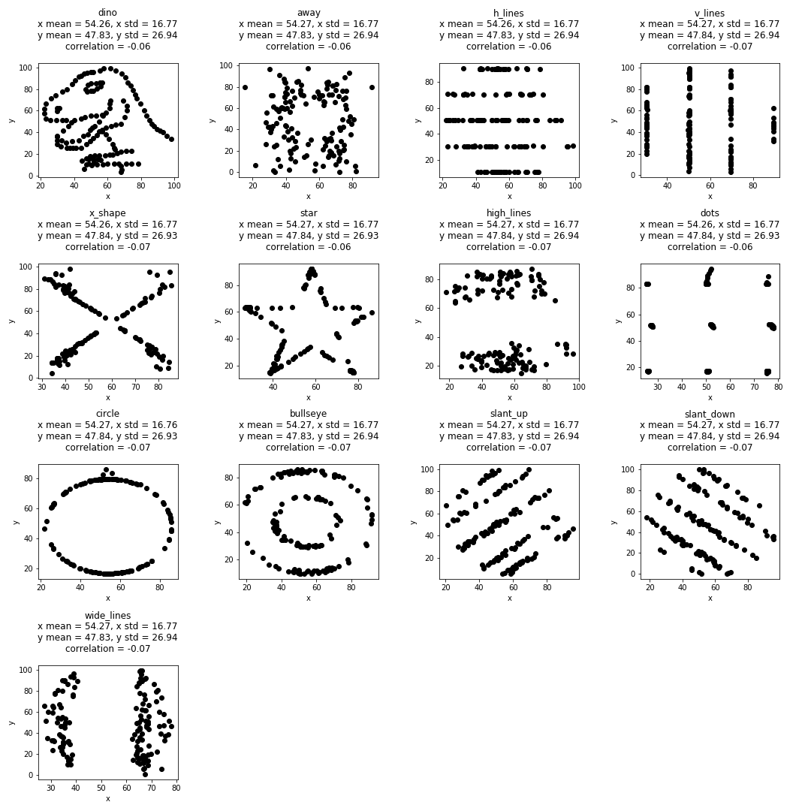
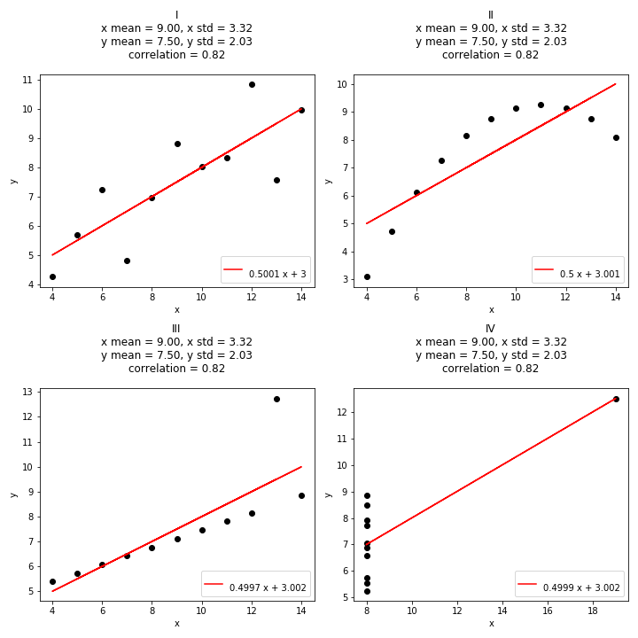

# Misleading Descriptive Statistics with Visualizations (Anscombe's Quartet & Datasaurus Dozen)

Matplotlib versions of the Anscombe Quartet & Datasaurus Dozen that I use for my blog. (It's much more practical to do this in excel though).

[Wikipedia describing Anscombe's Quartet](https://en.wikipedia.org/wiki/Anscombe%27s_quartet) and [original paper](https://www.tandfonline.com/doi/abs/10.1080/00031305.1973.10478966)

[Official page linking to the Datasaurus Dozen Research](https://www.autodesk.com/research/publications/same-stats-different-graphs)

[Link to the original Datasaurus described by Cairo](http://www.thefunctionalart.com/2016/08/download-datasaurus-never-trust-summary.html)

# The figures

	

The Datasaurus Dozen

	

Anscombe's Quartet

# How to run 
Open the jupyter or run the python script
